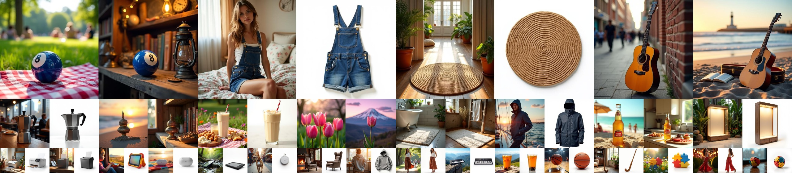

# Subjects200K Dataset


<a href="https://arxiv.org/abs/2411.15098"></a>
<a href="https://github.com/Yuanshi9815/OminiControl"></a>
<a href="https://huggingface.co/datasets/Yuanshi/Subjects200K"></a>


</br>

Subjects200K is a large-scale dataset containing 200,000 paired images, introduced as part of the [OminiControl](https://github.com/Yuanshi9815/OminiControl) project. Each image pair maintains subject consistency while presenting variations in scene context.

### Quick Start
<a href="https://huggingface.co/datasets/Yuanshi/Subjects200K"></a>

- Load dataset
  ```python
  from datasets import load_dataset

  # Load dataset
  dataset = load_dataset('Yuanshi/Subjects200K')
  ```

- Filter high-quality pairs from `collection_2`
  ```python
  def filter_func(item):
      if item.get("collection") != "collection_2":
          return False
      if not item.get("quality_assessment"):
          return False
      return all(
          item["quality_assessment"].get(key, 0) >= 5
          for key in ["compositeStructure", "objectConsistency", "imageQuality"]
      )
  
  collection_2_valid = dataset["train"].filter(
      filter_func,
      num_proc=16,
      cache_file_name="./cache/dataset/collection_2_valid.arrow", # Optional
  )
  ```


### Collections
**Collection1 (`collection_1`)** [Link 🔗](https://huggingface.co/datasets/Yuanshi/Subjects200K)
-  512 $\times$ 512 resolution, with 16-pixel padding.
-  Total 18,396 image pairs, with 8,200 pairs having high-quality ratings.

**Collection2 (`collection_2`)** [Link 🔗](https://huggingface.co/datasets/Yuanshi/Subjects200K)
-  512 $\times$ 512 resolution, with 16-pixel padding.
-  Total 187,840 image pairs, with 111,767 pairs having high-quality ratings.

**Collection3 (`collection_3`)** [Link 🔗](https://huggingface.co/datasets/Yuanshi/Subjects200K_collection3)
-  1024 $\times$ 1024 resolution.
>  The description formats may vary across different collections.

### Data Format
  | Key name             | Type    | Description                                                                                                                                                                                                |
  | -------------------- | ------- | ---------------------------------------------------------------------------------------------------------------------------------------------------------------------------------------------------------- |
  | `image`              | `image` | A composite image containing a pair of images with 16-pixel padding.                                                                                                                                       |
  | `collection`         | `str`   | The name or identifier of the source collection.                                                                                                                                                           |
  | `quality_assessment` | `dict`  | Quality scores evaluated by the ChatGPT-4o model. Each quality dimension is rated on a scale of 0-5. Recommended for filtering out low-quality image pairs which do not have all dimensions rated above 5. |
  | `description`        | `dict`  | Detailed textual description of the image pair contents.                                                                                                                                                   |


## Contributing
We welcome contributions! Please feel free to submit a Pull Request or open an Issue.

## Citation
```
@article{
  tan2024omini,
  title={OminiControl: Minimal and Universal Control for Diffusion Transformer},
  author={Zhenxiong Tan, Songhua Liu, Xingyi Yang, Qiaochu Xue, and Xinchao Wang},
  journal={arXiv preprint arXiv:2411.15098},
  year={2024}
}
```
